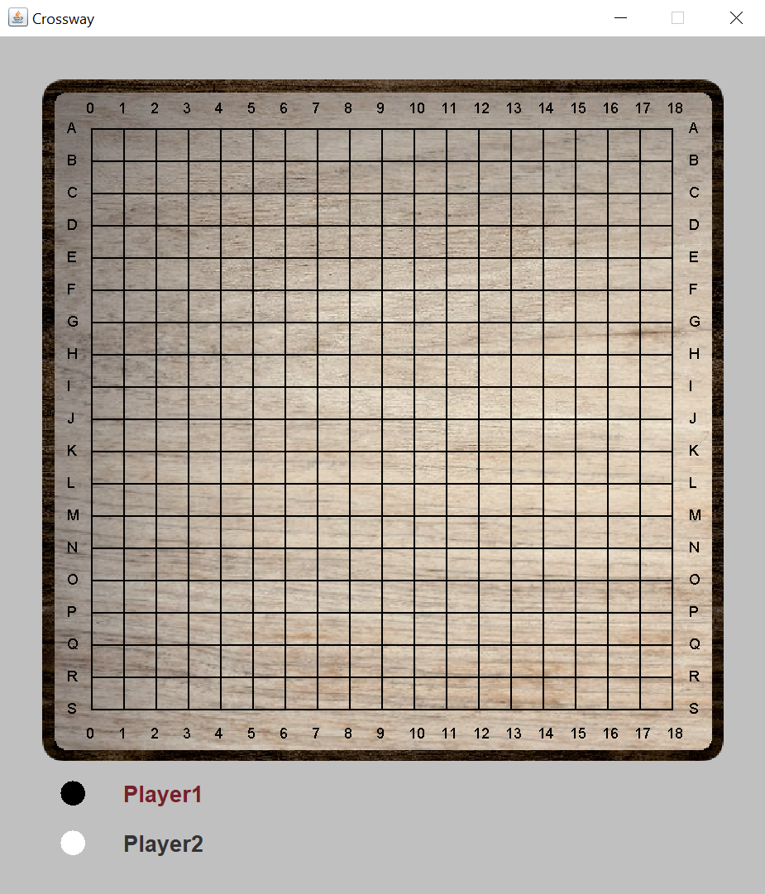
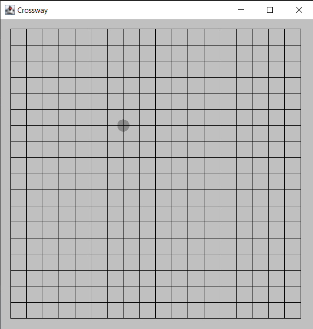
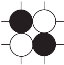

# Crossway 
#### Authors: R. Tolloi, M. Corsano, and G. Bernardi
### Built with:

### About this repository
This repository contains the project for the Software Development exam, A.Y. 2021/2022.
It is an implementation of the game Crossway in Java comprehensive of a Graphic 
User Interface.

This project was developed following the principles of AGILE software developing and
Test Driven Developing. Every part of the code was written on IntelliJ and GitHub was
used as a version control system. Gradle was instead used for the testing and CircleCI for
Continuous Integration.

### How to run the game
The only required software is OpenJdk-18, which can be installed through this page: https://jdk.java.net/18/.
Once OpenJdk-18 is installed, the user can download the executable

### Rules of the game   
Crossway is a 2-players game played on a 19x19 board that starts
empty, as shown in the picture below.

At the beginning of the game, each player chooses a colour 
between black and white. The black will place a piece first. 
Then, the players will keep alternating placing one piece per
turn. 

When the white player begins their first turn, they will have 
two options:
* placing a white piece wherever they prefer
* calling the "Pie Rule", which means stealing the black piece
already placed on the board

If the second option is chosen, the players will effectively
switch colours, and then the game will go on normally.

Pieces are to be placed on the intersections of the lines drawn
on the board. As shown in the below image, a transparent piece
will appear in the possible piece positions as the player moves
the mouse on the board.

To place a piece, the player needs to click on the chosen
position. The turn of the other player will then begin. 

The objective of the game is to form a contiguous sequence of 
white stones connecting the left edge of the board to the right
one for the white player, and to form a contiguous sequence of
black stones connecting the top edge of the board to the bottom
one for the black player.

When it is their turn, the player can place the piece wherever 
they prefer on the board; the only conditions are that the 
chosen position is not already occupied by another piece and that
 the below formation does not occur.

The software does not allow this placement and the GUI will not
display the transparent guide piece on coordinates that create
this issue. In this way, the player will be helped towards a 
correct piece placement.

If no possible placements are allowed for a player, they will 
skip their turn and the opponent will continue to place their
pieces until victory.

An "I give up" button is available to the players after the second turn. 

A "Play demo" button is also present in the initial screen; if
it is clicked, a demonstration of the game will start.

### Structure of the project
The package "it.units.crossway" Java package is divided in five Java packages.

1. The "controller" package contains all the classes that control the
correct flow of the game. It contains classes:
 * GameController, which controls the
execution of the game. It implements Controller.
 * Player, which is the player with their id, name, and colour.
 * Status, which controls the condition of the current piece.
 * WinRuler, which checks if a player has won.
 * Condition, which is an enum having values PLACED (the piece was 
 correctly placed), NOT PLACED (it was impossible to correctly place the piece),
 and WON (the piece was correctly placed and it is the winning piece.
 for the current player)
 * Controller, which is an interface.

2. The "gui" package contains all the classes related to the GUI.
It contains:
 * BoardPanel, which is the JPanel used to represent the board.
 * BoardPanelSettings, which is used to calculate and access the parameters of BoardPanel.
 * Gui, which controls the graphics part of the program, setting up the frame and
 all the different panels. It also manages the user interface with all the listeners, controlling the 
 interaction with the user.
 * PieceGui, which is used by the GUI to draw the inserted piece.
 * StartingPanel, which is the initial JPanel asking for the players' names
 and colours. It also allows the player to choose to watch the demo.
 * WinnerPanel, which is the JPanel that is showed when a player wins. It
 has a button "Rematch" which restarts the game and a "Close" one to close the app.
 
3. The "launcher" package contains the necessities to launch the game.
It contains:
 * Config, which contains all the constants.
 * Main, which is used to launch the game.

4. The "model" package contains the logic of the game. It contains:
 * Board, which is the board implemented as a matrix of nodes.
 * Coordinates, which implements the coordinates of the nodes on the
 board.
 * Node, which is where pieces are placed.
 * Piece, which is the implementation of the physical piece.
 * Direction, which is an enum containing the different diagonal directions 
 NORTH_EAST, NORTH_WEST, SOUTH_EAST, and SOUTH_WEST. It is used to simplify the
access to neighbour nodes.

5. The "utilities" package contains classes that are useful to the logic of 
the game, but are not effectively part of it. It contains:
* Graph, which implements an undirected graph (possibly cyclic).
* Vertex, which implements the vertex of the graph.
 
All the pictures (background and readme pictures) are contained in the
Pictures folder outside the package.