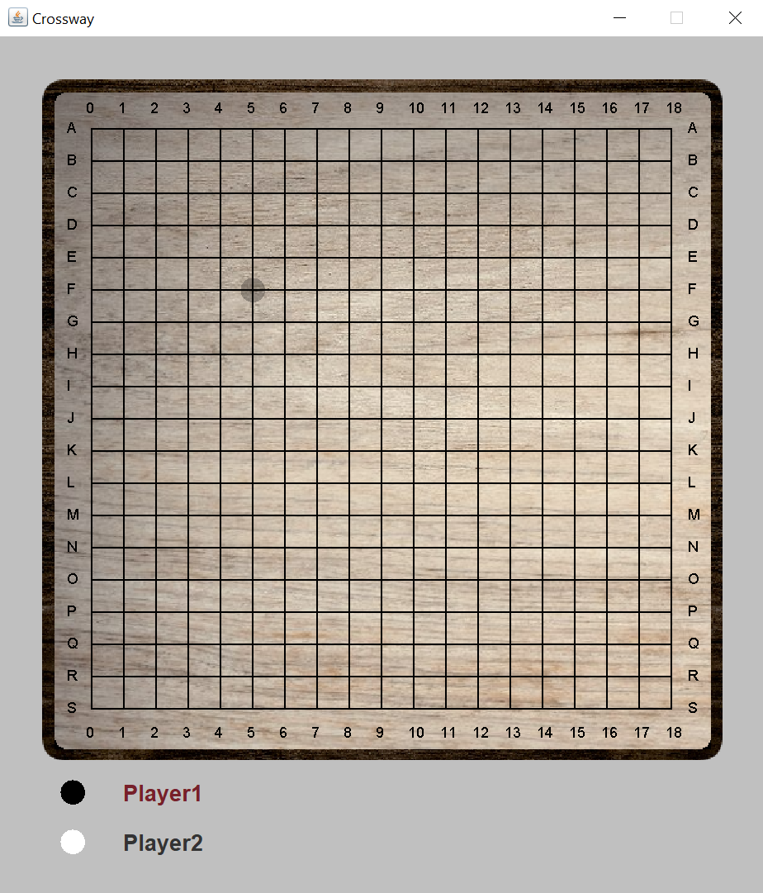

# Crossway

## Authors: R. Tolloi, M. Corsano, and G. Bernardi
### About this repository
This repository contains the project for the Software Development exam, A.A. 2021/2022.
It is an implementation of the game Crossway in Java comprehensive of a Graphic 
User Interface.

This project was developed following the principles of AGILE software developing and
Test Driven Developing. Every part of the code was written on IntelliJ and GitHub was
used as a version control system. Gradle was instead use for the testing.

### Rules of the game   
Crossway is a 2-players game played on a 19x19 board that starts
empty, as shown in the picture below.

At the beginning of the game, each player chooses a colour 
between black and white. The black will place a piece first. 
Then, the players will keep alternating placing one piece per
turn. 

When the white player begins their first turn, they will have 
two options:
* placing a white piece wherever they prefer
* stealing the black piece already placed on the board

If the second option is chosen, the players will effectively
switch colours, and then the game will go on normally.

Pieces are to be placed on the intersections of the lines drawn
on the board. As shown in the below image, a transparent piece
will appear in the possible piece positions as the player moves
the mouse on the board.

To place a piece, the player needs to click on the chosen
position. The turn of the other player will then begin. 

The objective of the game is to form a contiguous sequence of 
white stones connecting the left edge of the board to the right
one for the white player, and to form a contiguous sequence of
black stones connecting the top edge of the board to the bottom
one for the black player.

INSERIRE IMMAGINE PARTITA VINTA

When it is their turn, the player can place the piece wherever 
they prefer on the board; the only conditions are that the 
chosen position is not already occupied by another piece and that
 the below formation does not occur.

The software does not allow this placement and the GUI will not
display the transparent guide piece on coordinates that create
this issue. In this way, the player will be helped towards a 
correct piece placement.

If no possible placements are allowed for a player, they will 
skip their turn and the opponent will continue to place their
pieces until victory.

### Suggestions for running the project
Per runnare i test fai tasto destro Run with coverage sulla
cartella dei test e scegli quella di IntelliJ non Gradle.   
Oppure, in alto scegli la suite  (a sx del run button) con IntelliJ e la cartella che vuoi
e poi clicca il run button con lo scudo