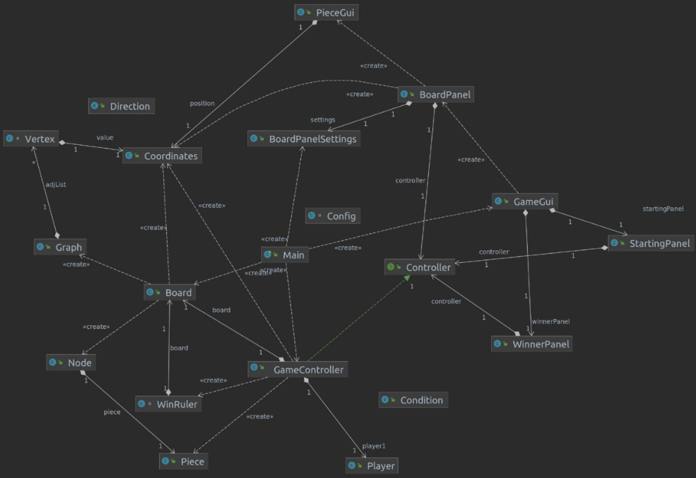

# Structure of the project
The "it.units.crossway" Java package is divided in five Java packages.

### Controller
The [controller](src/main/java/it/units/crossway/controller) package contains all the classes that control the
   correct flow of the game and interaction between the data and the interface.
It contains the following files:
* GameController, which controls the execution of the game and the communication
  between Gui and Model packages. It implements Controller.
* Player, which represents the player with their id, name, and colour.
* WinRuler, which can assert if a player has won or not.
* Condition, which is an enum having values PLACED (the piece was
  correctly placed), NOT PLACED (it was impossible to correctly place the piece),
  and WON (the piece was correctly placed, and it is the winning piece for the current player)
* Controller, which is an interface.

### Gui
The [Gui](src/main/java/it/units/crossway/gui) package contains all the classes related to the GUI.
   It contains:
* BoardPanel, which is the JPanel used to represent the board.
* BoardPanelSettings, which is used to calculate and access the parameters of BoardPanel.
* GameGui, which controls the graphics part of the program, setting up the frame and
  all the different panels. It also manages the user interface with all the listeners, controlling the
  interaction with the user.
* PieceGui, which is used by the GUI to draw the inserted piece.
* StartingPanel, which is the initial JPanel asking for the players' names
  and colours. It also allows the player to choose to watch the demo.
* WinnerPanel, which is the JPanel that is showed when a player wins. It
  has a button "Rematch" which restarts the game and a "Close" one to close the app.

### Launcher
The [launcher](src/main/java/it/units/crossway/launcher) package contains the necessities to launch the game.
   It contains:
* Config, which contains all the constants.
* Main, which is used to launch the game.

### Model
The [model](src/main/java/it/units/crossway/model) package contains the logic of the game. It contains:
* Board, which is the board implemented as a matrix of nodes.
* Coordinates, which implements the coordinates of the nodes on the
  board.
* Node, which is where pieces are placed.
* Piece, which is the implementation of the physical piece.
* Direction, which is an enum containing the different diagonal directions
  NORTH_EAST, NORTH_WEST, SOUTH_EAST, and SOUTH_WEST. It is used to simplify the
  access to neighbour nodes.

### Utilities
The [utilities](src/main/java/it/units/crossway/utilities) package contains classes that are useful to the logic of
   the game, but are not effectively part of it. It contains:
* Graph, which implements an undirected graph (possibly cyclic).
* Vertex, which implements the vertex of the graph.

### UML diagram
Here it is also a UML diagram that can help achieve a rough understanding of
how the classes interact with each other.

  

